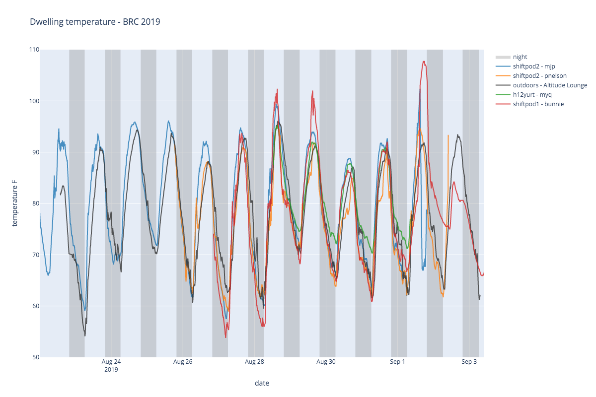
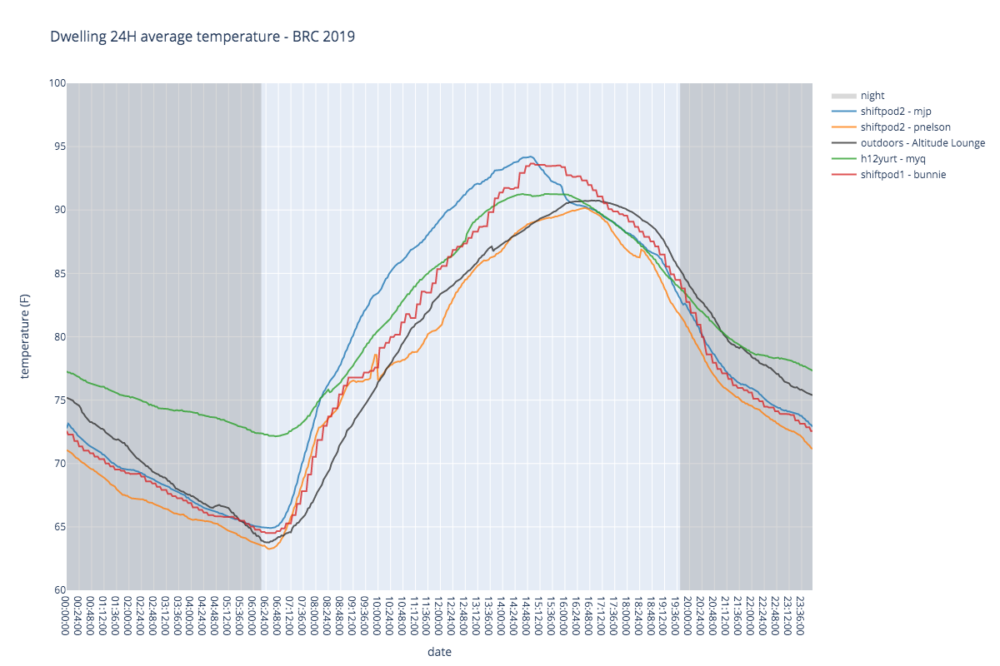

# Phage Dwelling Temperatures - Black Rock City 2019

Comparison of dwelling temperatures at The Phage, 4:00 &amp; Esp, Burning Man 2019

An examination of thermodynamics in a variety of playa dwellings:
* baseline outdoor recording (Taken from Altitude Lounge @ 845&C)
* shiftpod 1 (A/C, no shade)
* shiftpod 2 - mjp (light use of swamp cooler, shade structure)
* shiftpod 2 - pnelson (heavy use of swamp cooler, shade structure, blastshield)
* H12 hexayurt (no cooling)

Interactive temperature graphs here
https://mpesavento.github.io/phage_temperature_2019/

## Study summary
Shiftpod in the shade with active cooling is the best. Ventilation (pulling out the hot air from the top)
works better than evaporative cooling, eg through a 
[swamp cooler](https://www.reddit.com/r/BurningMan/comments/6ol1ts/steps_to_build_a_figjam_bucket_cooler/).

A similar experiment was done here:
https://blog.cjtrowbridge.com/2019/11/20/data-are-shiftpods-actually-cooler/

