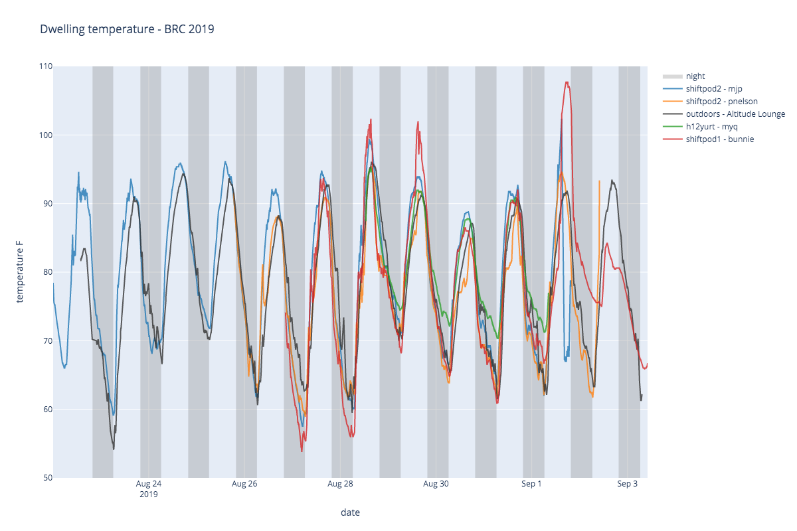
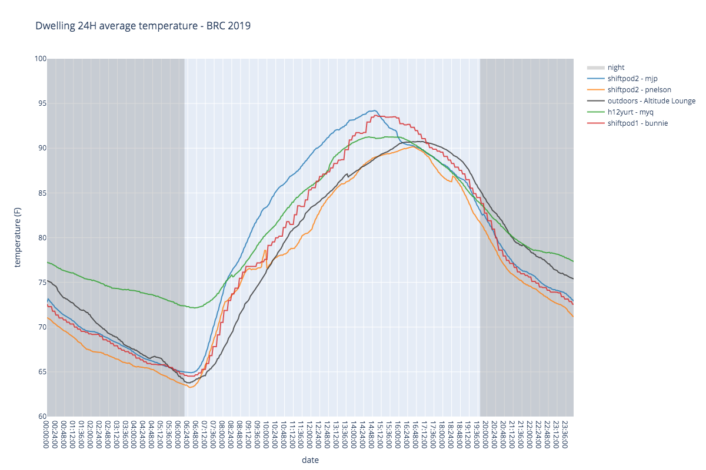

# Phage Dwelling Temperatures - Black Rock City 2019

Comparison of dwelling temperatures at The Phage, 4:00 &amp; Esp, Burning Man 2019

An examination of thermodynamics in a variety of playa dwellings:
* baseline outdoor recording (Taken from Altitude Lounge @ 845&C)
* shiftpod 1 (no cooling/shade)
* shiftpod 2 - mjp (light use of swamp cooler, shade structure)
* shiftpod 2 - pnelson (heavy use of swamp cooler, shade structure, blastshield)
* H12 hexayurt (no cooling)

## TODO
Embedding the interactive plots in the repository's [github page](https://mpesavento.github.io/phage_temperature_2019/) would make the graphs interactive, and embedded in a blog-styled page via Jekyll.

[how to use plotly with Jekyll](http://ryankuhn.net/blog/How-To-Use-Plotly-With-Jekyll)

Embedding the html pages in an `iframe` tag in Jeykll should be straightforward... but it's not.
[Embedding plotly in a website](https://towardsdatascience.com/how-to-create-a-plotly-visualization-and-embed-it-on-websites-517c1a78568b)
